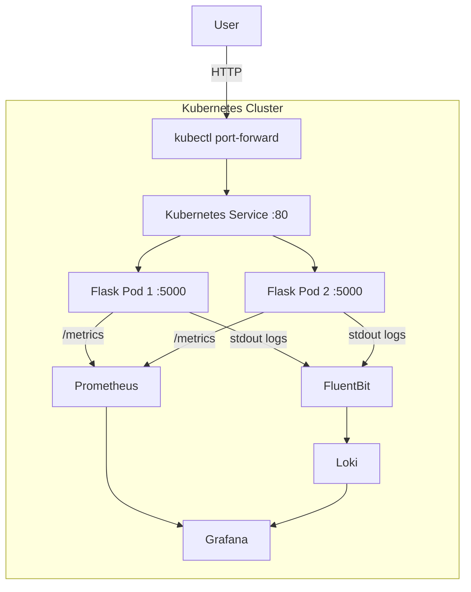

# Architecture

```mermaid
graph TD
    User -->|HTTP| KPort[kubectl port-forward]
    KPort --> Service[Kubernetes Service :80]
    Service --> Pod1[Flask Pod 1 :5000]
    Service --> Pod2[Flask Pod 2 :5000]

    Pod1 -->|/metrics| Prometheus
    Pod2 -->|/metrics| Prometheus
    Prometheus --> Grafana

    Pod1 -->|stdout logs| FluentBit
    Pod2 -->|stdout logs| FluentBit
    FluentBit --> Loki
    Loki --> Grafana

    subgraph Kubernetes Cluster
        KPort
        Service
        Pod1
        Pod2
        Prometheus
        Grafana
        FluentBit
        Loki
    end
```
