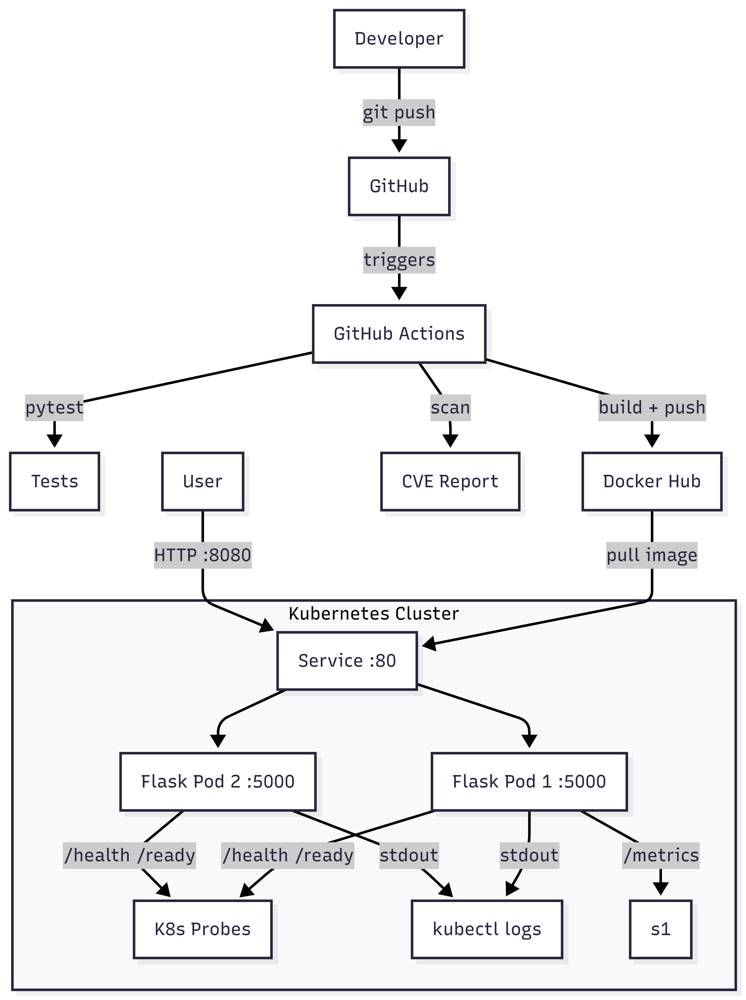
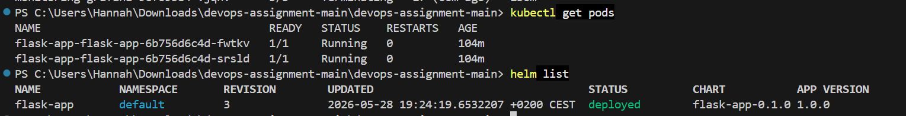
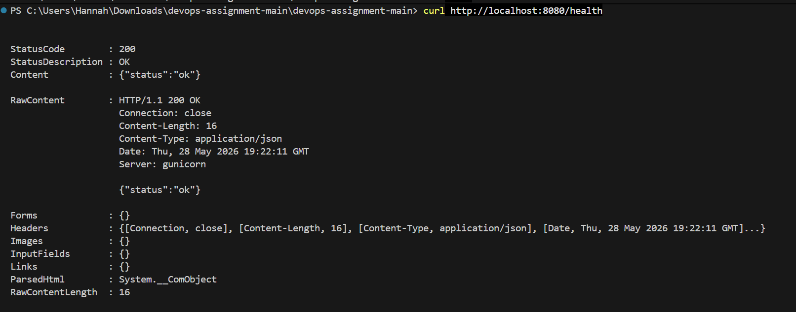
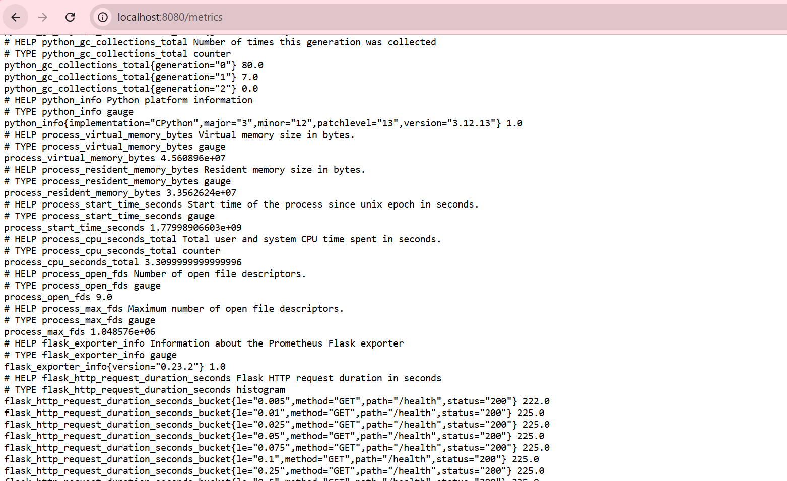
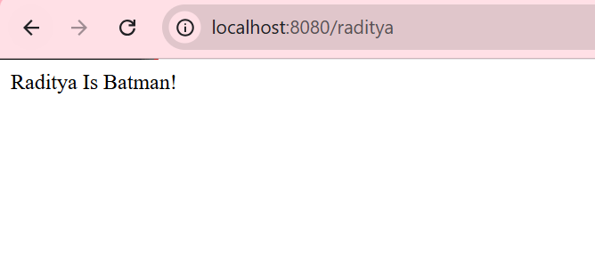
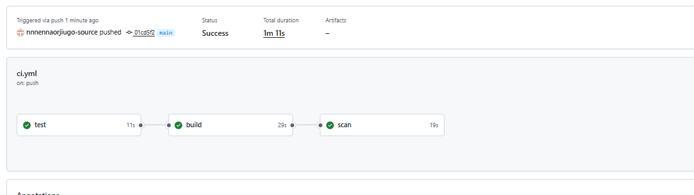

# Solution

## Summary of Changes

**Modified files:**
- `app.py` — added `/health`, `/ready`, `/metrics` endpoints and stdout logging
- `requirements.txt` — added `gunicorn`, `prometheus_flask_exporter`, `pytest`

**New files:**
- `Dockerfile` — containerizes the Flask app with a non-root user running gunicorn
- `test_app.py` — unit tests for all app routes
- `chart/Chart.yaml` — Helm chart metadata
- `chart/values.yaml` — default values (image, resources, security context, probes)
- `chart/values-dev.yaml` — dev environment overrides
- `chart/values-prod.yaml` — prod environment overrides
- `chart/templates/deployment.yaml` — Kubernetes Deployment with security hardening
- `chart/templates/service.yaml` — Kubernetes Service
- `chart/templates/serviceaccount.yaml` — dedicated ServiceAccount
- `chart/templates/hpa.yaml` — HorizontalPodAutoscaler
- `chart/templates/pdb.yaml` — PodDisruptionBudget
- `chart/templates/networkpolicy.yaml` — NetworkPolicy restricting ingress/egress
- `chart/templates/_helpers.tpl` — Helm template helpers
- `chart/templates/NOTES.txt` — post-install instructions
- `.github/workflows/ci.yml` — CI pipeline: test → build → scan
- `solution.md` — this document

---

## Overview

This solution containerizes a simple Flask application and deploys it to a local Kubernetes cluster using Helm. It includes a CI pipeline via GitHub Actions, basic observability, and security hardening at both the container and Kubernetes levels.



---

## Prerequisites

- [Docker](https://docs.docker.com/get-docker/)
- [Minikube](https://minikube.sigs.k8s.io/docs/start/)
- [kubectl](https://kubernetes.io/docs/tasks/tools/)
- [Helm](https://helm.sh/docs/intro/install/)
- A [Docker Hub](https://hub.docker.com/) account

---

## Build & Deploy (Local)

### 1. Start Minikube

```bash
minikube start
```

### 2. Build and push the Docker image

Replace `yourdockerhubusername` with your Docker Hub username.

```bash
docker build -t yourdockerhubusername/flask-app:latest .
docker login
docker push yourdockerhubusername/flask-app:latest
```

### 3. Update the image repository in the Helm chart

Edit `chart/values.yaml` and set:

```yaml
image:
  repository: yourdockerhubusername/flask-app
  tag: latest
```

### 4. Deploy the app

```bash
helm install flask-app ./chart
```

Verify the pods are running:

```bash
kubectl get pods -l app.kubernetes.io/name=flask-app
```

### 5. Access the app

```bash
kubectl port-forward svc/flask-app-flask-app 8080:80
```

Open [http://localhost:8080](http://localhost:8080) — it will redirect randomly to `/sergei` or `/raditya`.

```bash
curl http://localhost:8080/health
curl http://localhost:8080/ready
curl http://localhost:8080/metrics
```

---

## CI Pipeline

The pipeline runs on every push to `main` via GitHub Actions (`.github/workflows/ci.yml`).

| Job | What it does |
|---|---|
| `test` | Installs dependencies and runs `pytest` |
| `build` | Builds and pushes the Docker image to Docker Hub, tagged with the short Git SHA |
| `scan` | Runs a Trivy vulnerability scan against the pushed image, reporting HIGH and CRITICAL CVEs |

### Required GitHub Secrets

Add these in your repository under Settings → Secrets → Actions:

| Secret | Value |
|---|---|
| `DOCKERHUB_USERNAME` | Your Docker Hub username |
| `DOCKERHUB_TOKEN` | A Docker Hub access token (not your password) |

---

## Security

Security hardening has been applied at every layer — container, Kubernetes, and CI pipeline.

| Measure | Where | Detail |
|---|---|---|
| Non-root user | Dockerfile | Dedicated `appuser` system user, `USER appuser` directive |
| Non-root enforcement | Helm chart | `runAsNonRoot: true`, `runAsUser: 1000` |
| Read-only filesystem | Helm chart | `readOnlyRootFilesystem: true` — container cannot write to its own filesystem |
| No privilege escalation | Helm chart | `allowPrivilegeEscalation: false` |
| Dropped capabilities | Helm chart | `capabilities.drop: [ALL]` — all Linux capabilities removed |
| Resource limits | Helm chart | CPU and memory limits prevent resource exhaustion |
| Network policy | Helm chart | Restricts ingress to port 5000 only; egress to DNS only |
| Dedicated service account | Helm chart | App runs under its own ServiceAccount, not the shared default |
| Image vulnerability scanning | CI pipeline | Trivy scans for HIGH and CRITICAL CVEs on every push to `main` |

---

## Observability

Basic observability is covered by three things:

### Health Probes
Liveness and readiness probes are wired into the Helm chart:

- `/health` — liveness probe, tells Kubernetes if the pod should be restarted
- `/ready` — readiness probe, tells Kubernetes if the pod should receive traffic

### Logs
The app logs to stdout. Kubernetes collects this automatically and it is accessible via `kubectl logs`. In production this would be shipped to a log aggregation system such as Loki via FluentBit.

### Metrics
`prometheus_flask_exporter` exposes a `/metrics` endpoint on every pod:
```bash
curl http://localhost:8080/metrics
```
In production this would be scraped by Prometheus via a ServiceMonitor and visualised in Grafana.

---

## Tradeoffs & Known Issues


**Single-node Minikube** — two replicas on a single node provide no real redundancy. The `replicaCount: 2` value demonstrates the Helm parameterisation but has full effect only on a multi-node cluster.

**No ingress controller** — access is via `kubectl port-forward`. A proper Ingress resource with an NGINX or Traefik controller would be the next step beyond local testing.

**Image tag `latest` in values.yaml** — the CI pipeline tags images with the short Git SHA and pushes both `latest` and the SHA tag to Docker Hub. The `latest` default in `values.yaml` is intentional for local development — in a real deployment `helm upgrade --set image.tag=$GIT_SHA` would pin to the exact build.

---

## What I'd Do With More Time

- Deploy a full observability stack (Prometheus, Grafana, Loki, FluentBit) and wire up metrics scraping via a ServiceMonitor
- Add structured JSON logging for better log querying
- Add an Ingress resource with TLS termination
- Pin the base Docker image to a specific digest for reproducible builds
- Set up Prometheus alerting rules for error rate thresholds
- Store secrets in a proper secrets manager rather than values files

---

## Troubleshooting

### CrashLoopBackOff — No usable temporary directory

**Error**
```
FileNotFoundError: [Errno 2] No usable temporary directory found in ['/tmp', '/var/tmp', '/usr/tmp', '/app']
```

**Cause:** `readOnlyRootFilesystem: true` blocks Python and gunicorn from writing temp files.

**Troubleshoot:** `kubectl logs <pod-name>`

**Solution:** Mount an `emptyDir` volume at `/tmp` in `deployment.yaml`.

**Upgrade:**
```bash
helm upgrade flask-app ./chart
```

---

---

## Screenshots

### Pods Running


### Health & Readiness


### Metrics


### Application


### CI Pipeline


---

### Port 8080 already in use

**Error:** `curl` returns a response from a different service, not the Flask app.

**Cause:** Another process is already listening on port 8080.

**Troubleshoot:**
```bash
netstat -ano | findstr :8080
Get-Process -Id <PID>
```

**Solution:** Kill the process or use a different local port:
```bash
kubectl port-forward svc/flask-app-flask-app 9090:80
```
